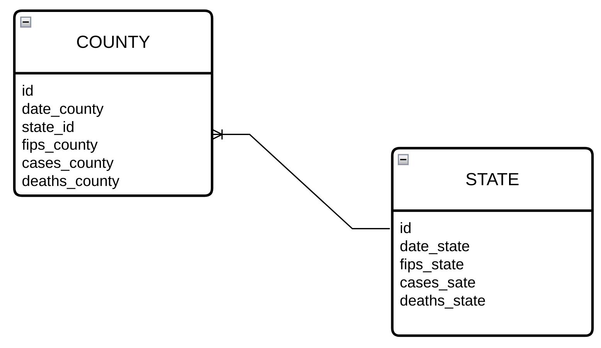
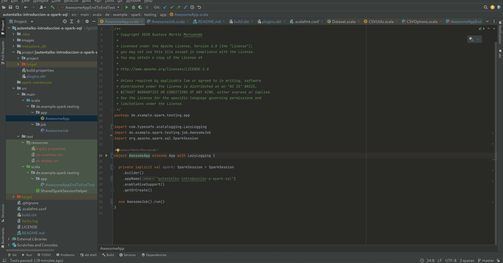

autenTalks: Introducción a Spark SQL
=========================

## Tables



## Building

### Prerequisites

* In order to build this project [**JVM 8**](https://docs.aws.amazon.com/corretto/latest/corretto-8-ug/downloads-list.html) must be available in your environment.
* IntelliJ must be using the scala plugin


* IntelliJ must be using JDK 8


* If you want to build this project from the command line interface you will need also to install [**sbt**](https://www.scala-sbt.org/download.html).

### Command

Command to be run if you want to build this project from the CLI.
```
sbt clean compile scalastyle coverage test test:scalastyle coverageReport
```

## Assembly, generate jar file

Command to be run if you want to package this project from the CLI.
```
sbt assembly
```

